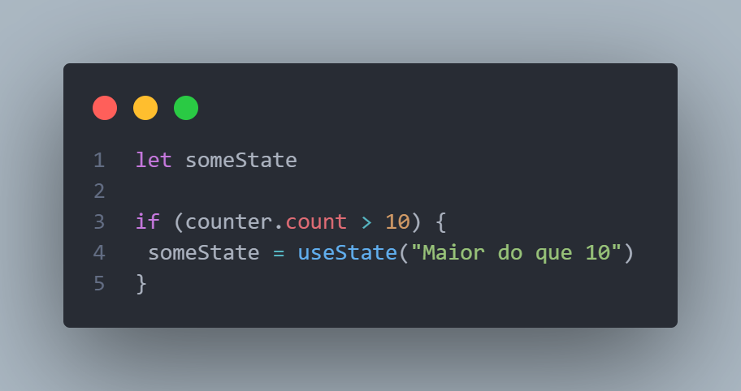

# Hooks

Os hooks são funçoes especiais do react que permite que  a gente se conecte ao seu sistema interno. Que seria a forma como ele lida com a interação com dom, montagem e desmontagem dos elementos, isso é o mecanismo interno do react, e os hooks permite que entre dentro desse mecanisco ou extenda ele, modificar certos comportamentos e usar certos recursos.

O useState é um hook do react.

Duas regras especiais para os hooks.

Regra 1 - Onde usar os hooks?
 --  Não pode utilizar em qualquer lugar, só dentro de uma função que um componente React. Não funciona em nenhum outro lugar que não seja uma função de um componente.

 Exceto se criar o próprio hook customizado.

 
 
 
 

Regra 2 - Importância da ordem dos hooks.

O React monitora a ordem em que estamos utilizando os hooks, ele basicamente cria uma lista interna sobre os quais foram chamados.

Os hooks devem ser chamados no top level da função, pois se eu utilizar em por exemplo num if, não funciona, pois a condição pode ser falsa.

 